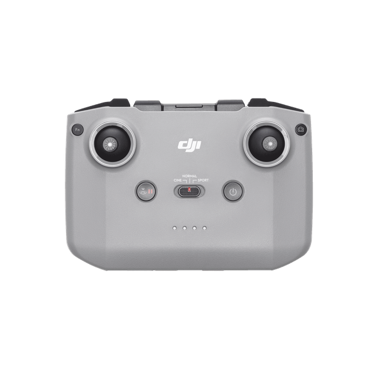
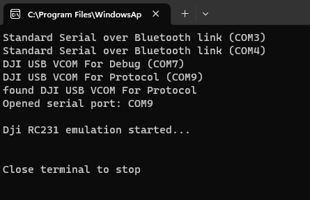
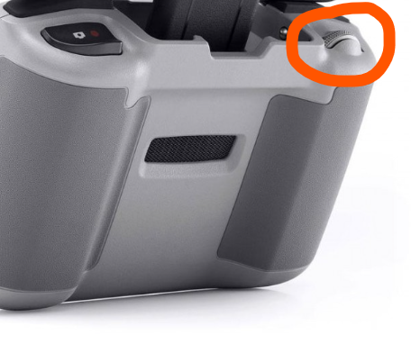
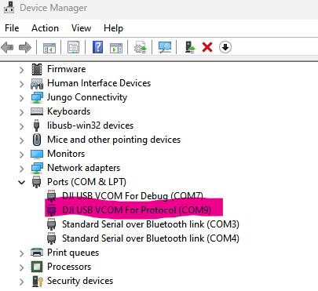
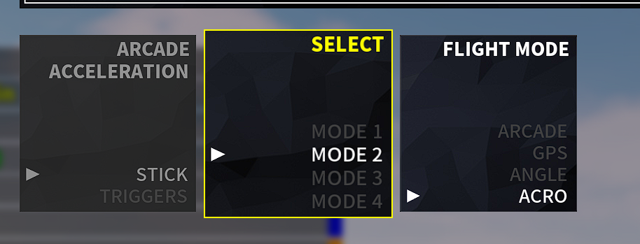
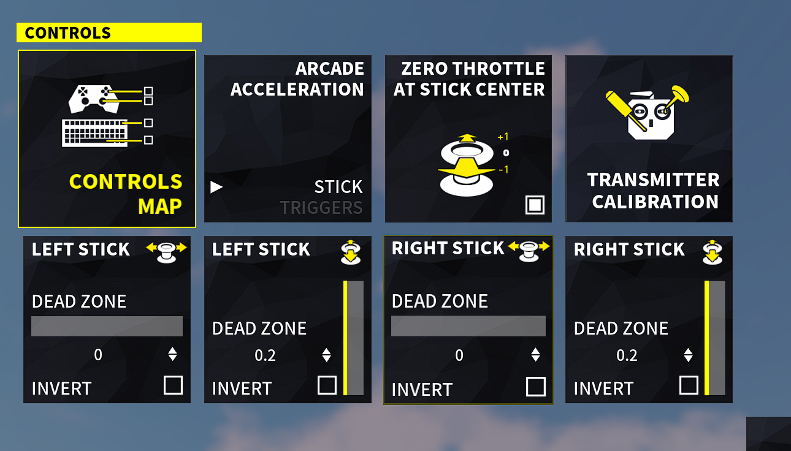

DJI RC-N1
===============
 - Connect your DJI Remote Controller to your PC and use it to play simulators
 - Confirmed DJI Mavic 3 RC231
 - For Mavic Mini or a Python interface, take a look at [justin97530/miniDjiController](https://github.com/justin97530/miniDjiController)
 - For DJI Mini 2 or a Python interface, take a look at [usatenko/DjiMini2RCasJoystick](https://github.com/usatenko/DjiMini2RCasJoystick)
 - For DJI Phantom 3 take a look at [mishavoloshchuk/mDjiController](https://github.com/mishavoloshchuk/mDjiController)
-----------------------------------------------------------------------------

This is a program that connects to your DJI Mavic 3 Remote Controller (RC-N1) as a XBox360 gamepad,
reads the stick positions and tells Windows that position.

-----------------------------------------------------------------------------
Installation / Usage
- Install packages before usage:
- pip3 install vgamepad
- pip3 install pyserial

- Power on RC-N1
- Connect via bottom type-C
- run main.py
- run yor simulator

for restart game or recover drone: use camera wheel, left scroll

TROUBLESHOOTING
-----------------------------------------------------------------------------
App searching by itself for the serial port with description "DJI USB VCOM For Protocol"
make sure your device attached via bottom Type-C connector

[Tested with DCL - The game](https://store.steampowered.com/app/964570/DCL__The_Game/) 

    Preset:
    Mode 2
    Acro
    Zero throttle at stick center

